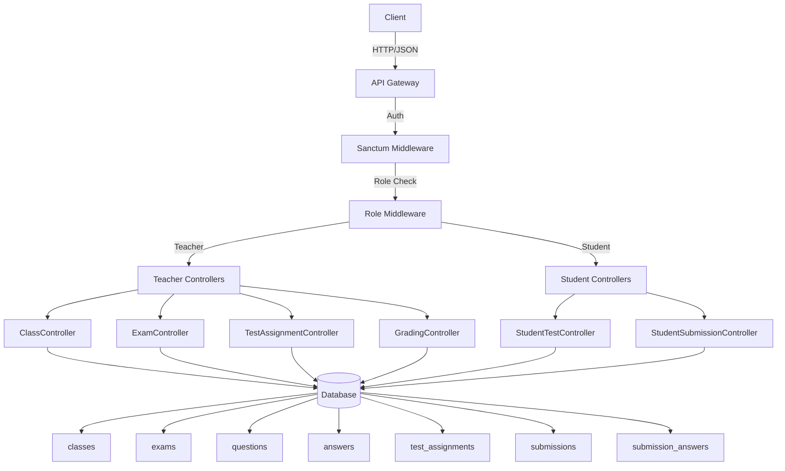
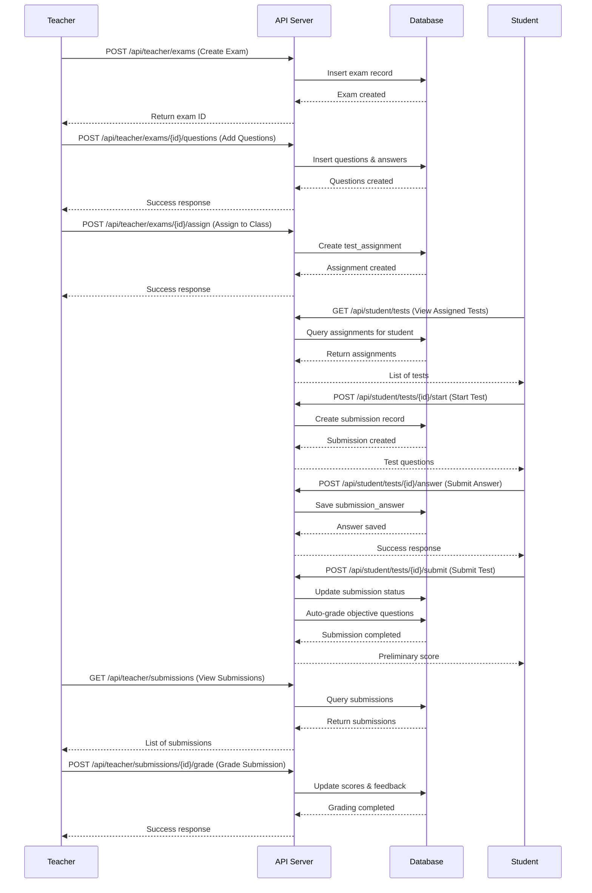

# Design Document: Test System APIs

## Overview

The Test System APIs provide comprehensive functionality for managing exams, tests, assignments, and student submissions in the Nam Thu Edu platform. This system enables teachers to create and manage exams with questions, assign tests to classes or individual students, and grade submissions. Students can view assigned tests, take exams, submit answers, and view their results with feedback.

The system integrates with the existing Laravel backend, utilizing Sanctum authentication and role-based middleware. It follows RESTful API design patterns consistent with existing Course and Blog management APIs.

## Architecture



## Main Workflow




## Components and Interfaces

### Component 1: ClassController

**Purpose**: Manage classes and student enrollments

**Interface**:
```php
class ClassController extends Controller
{
    public function index(Request $request): JsonResponse;
    public function store(Request $request): JsonResponse;
    public function show(Request $request, int $id): JsonResponse;
    public function update(Request $request, int $id): JsonResponse;
    public function destroy(Request $request, int $id): JsonResponse;
    public function enroll(Request $request, int $id): JsonResponse;
}
```

**Responsibilities**:
- List all classes for authenticated teacher
- Create new class with validation
- Retrieve class details with enrolled students
- Update class information
- Soft delete class
- Enroll students into class (single or bulk)

### Component 2: ExamController

**Purpose**: Manage exams/tests and their questions

**Interface**:
```php
class ExamController extends Controller
{
    public function index(Request $request): JsonResponse;
    public function store(Request $request): JsonResponse;
    public function show(Request $request, int $id): JsonResponse;
    public function update(Request $request, int $id): JsonResponse;
    public function destroy(Request $request, int $id): JsonResponse;
    public function addQuestions(Request $request, int $id): JsonResponse;
    public function updateQuestion(Request $request, int $examId, int $questionId): JsonResponse;
    public function deleteQuestion(Request $request, int $examId, int $questionId): JsonResponse;
}
```


**Responsibilities**:
- List all exams created by teacher
- Create new exam with metadata
- Retrieve exam details with questions and answers
- Update exam information
- Soft delete exam
- Add questions with multiple answers to exam
- Update existing question
- Delete question from exam

### Component 3: TestAssignmentController

**Purpose**: Assign tests to classes or individual students

**Interface**:
```php
class TestAssignmentController extends Controller
{
    public function assign(Request $request, int $examId): JsonResponse;
    public function index(Request $request): JsonResponse;
    public function destroy(Request $request, int $id): JsonResponse;
}
```

**Responsibilities**:
- Assign exam to class or specific students
- List all test assignments with filters
- Delete/cancel assignment

### Component 4: GradingController

**Purpose**: Grade student submissions and provide feedback

**Interface**:
```php
class GradingController extends Controller
{
    public function index(Request $request): JsonResponse;
    public function show(Request $request, int $id): JsonResponse;
    public function grade(Request $request, int $id): JsonResponse;
}
```


**Responsibilities**:
- List all submissions with filters (by exam, student, status)
- Retrieve detailed submission with all answers
- Grade submission (update scores, add feedback)
- Auto-calculate total score

### Component 5: StudentTestController

**Purpose**: Student interface for viewing and taking tests

**Interface**:
```php
class StudentTestController extends Controller
{
    public function index(Request $request): JsonResponse;
    public function show(Request $request, int $id): JsonResponse;
    public function start(Request $request, int $id): JsonResponse;
    public function answer(Request $request, int $id): JsonResponse;
    public function submit(Request $request, int $id): JsonResponse;
}
```

**Responsibilities**:
- List assigned tests for authenticated student
- Retrieve test details (questions without correct answers)
- Start test attempt (create submission record)
- Submit answer for a question
- Submit completed test (finalize submission)

### Component 6: StudentSubmissionController

**Purpose**: Student interface for viewing submission history and results

**Interface**:
```php
class StudentSubmissionController extends Controller
{
    public function index(Request $request): JsonResponse;
    public function show(Request $request, int $id): JsonResponse;
}
```


**Responsibilities**:
- List submission history for authenticated student
- Retrieve detailed submission with scores and feedback

## Data Models

### Model 1: Classes

```php
interface ClassesModel {
    cId: int;
    cName: string;
    cTeacher_id: int;
    cDescription: string | null;
    cStatus: 'active' | 'inactive';
    cCreated_at: DateTime;
    course: int | null;
    
    // Relationships
    teacher: User;
    enrollments: ClassEnrollment[];
    students: User[];
}
```

**Validation Rules**:
- cName: required, max 100 characters
- cTeacher_id: required, exists in users table
- cStatus: enum ('active', 'inactive')

### Model 2: ClassEnrollment

```php
interface ClassEnrollmentModel {
    class_id: int;
    student_id: int;
    enrolled_at: DateTime;
    
    // Relationships
    class: Classes;
    student: User;
}
```

**Validation Rules**:
- class_id: required, exists in classes table
- student_id: required, exists in users table with role='student'
- Composite primary key (class_id, student_id)


### Model 3: Exam

```php
interface ExamModel {
    eId: int;
    eTitle: string;
    eDescription: string | null;
    eType: 'VSTEP' | 'IELTS' | 'TOEIC' | 'GENERAL';
    eSkill: 'listening' | 'reading' | 'writing' | 'speaking';
    eTeacher_id: int;
    eDuration_minutes: int;
    eIs_private: boolean;
    eSource_type: 'manual' | 'upload';
    eCreated_at: DateTime;
    
    // Relationships
    teacher: User;
    questions: Question[];
    assignments: TestAssignment[];
    submissions: Submission[];
}
```

**Validation Rules**:
- eTitle: required, max 255 characters
- eType: enum ('VSTEP', 'IELTS', 'TOEIC', 'GENERAL')
- eSkill: enum ('listening', 'reading', 'writing', 'speaking')
- eTeacher_id: required, exists in users table with role='teacher'
- eDuration_minutes: required, integer, min 1
- eIs_private: boolean, default false
- eSource_type: enum ('manual', 'upload')

### Model 4: Question

```php
interface QuestionModel {
    qId: int;
    exam_id: int;
    qContent: string;
    qMedia_url: string | null;
    qPoints: int;
    qTranscript: string | null;
    qExplanation: string | null;
    qListen_limit: int | null;
    qCreated_at: DateTime;
    
    // Relationships
    exam: Exam;
    answers: Answer[];
}
```


**Validation Rules**:
- exam_id: required, exists in exams table
- qContent: required, text
- qPoints: required, integer, min 0
- qListen_limit: nullable, integer, min 1

### Model 5: Answer

```php
interface AnswerModel {
    aId: int;
    question_id: int;
    aContent: string;
    aIs_correct: boolean;
    
    // Relationships
    question: Question;
}
```

**Validation Rules**:
- question_id: required, exists in questions table
- aContent: required, text
- aIs_correct: boolean, default false
- At least one answer per question must have aIs_correct = true

### Model 6: TestAssignment

```php
interface TestAssignmentModel {
    taId: int;
    exam_id: int;
    taTarget_type: 'class' | 'student';
    taTarget_id: int;
    taDeadline: DateTime | null;
    taMax_attempt: int;
    taIs_public: boolean;
    taCreated_at: DateTime;
    
    // Relationships
    exam: Exam;
    submissions: Submission[];
    target: Classes | User; // Polymorphic
}
```


**Validation Rules**:
- exam_id: required, exists in exams table
- taTarget_type: enum ('class', 'student')
- taTarget_id: required, exists in classes or users table based on taTarget_type
- taDeadline: nullable, datetime, must be future date
- taMax_attempt: required, integer, min 1, default 1
- taIs_public: boolean, default false

### Model 7: Submission

```php
interface SubmissionModel {
    sId: int;
    user_id: int;
    exam_id: int;
    assignment_id: int | null;
    sAttempt: int;
    sStart_time: DateTime;
    sSubmit_time: DateTime | null;
    sScore: decimal(5,2) | null;
    sTeacher_feedback: string | null;
    sGemini_feedback: string | null;
    sStatus: 'in_progress' | 'submitted' | 'graded';
    
    // Relationships
    user: User;
    exam: Exam;
    assignment: TestAssignment;
    answers: SubmissionAnswer[];
}
```

**Validation Rules**:
- user_id: required, exists in users table with role='student'
- exam_id: required, exists in exams table
- assignment_id: nullable, exists in test_assignments table
- sAttempt: required, integer, min 1
- sStart_time: required, datetime
- sSubmit_time: nullable, datetime, must be after sStart_time
- sScore: nullable, decimal, min 0, max 100
- sStatus: enum ('in_progress', 'submitted', 'graded')


### Model 8: SubmissionAnswer

```php
interface SubmissionAnswerModel {
    saId: int;
    submission_id: int;
    question_id: int;
    saAnswer_text: string;
    saIs_correct: boolean | null;
    saPoints_awarded: decimal(5,2) | null;
    
    // Relationships
    submission: Submission;
    question: Question;
}
```

**Validation Rules**:
- submission_id: required, exists in submissions table
- question_id: required, exists in questions table
- saAnswer_text: required, text
- saIs_correct: nullable, boolean
- saPoints_awarded: nullable, decimal, min 0

## Algorithmic Pseudocode

### Main Processing Algorithm: Test Submission Flow

```pascal
ALGORITHM processTestSubmission(submissionId)
INPUT: submissionId of type Integer
OUTPUT: result of type SubmissionResult

BEGIN
  ASSERT submissionId > 0
  ASSERT submissionExists(submissionId) = true
  
  // Step 1: Retrieve submission with all answers
  submission ← getSubmissionById(submissionId)
  ASSERT submission.sStatus = 'submitted'
  
  // Step 2: Auto-grade objective questions
  totalScore ← 0
  maxScore ← 0
  
  FOR each answer IN submission.answers DO
    ASSERT answer.question_id IS NOT NULL
    
    question ← getQuestionById(answer.question_id)
    correctAnswer ← getCorrectAnswer(question.qId)
    
    maxScore ← maxScore + question.qPoints
    
    IF answer.saAnswer_text = correctAnswer.aContent THEN
      answer.saIs_correct ← true
      answer.saPoints_awarded ← question.qPoints
      totalScore ← totalScore + question.qPoints
    ELSE
      answer.saIs_correct ← false
      answer.saPoints_awarded ← 0
    END IF
    
    saveSubmissionAnswer(answer)
  END FOR
  
  // Step 3: Calculate final score percentage
  scorePercentage ← (totalScore / maxScore) * 100
  
  // Step 4: Update submission
  submission.sScore ← scorePercentage
  submission.sStatus ← 'graded'
  saveSubmission(submission)
  
  ASSERT submission.sScore >= 0 AND submission.sScore <= 100
  
  RETURN SubmissionResult(submission.sId, scorePercentage, totalScore, maxScore)
END
```


**Preconditions:**
- submissionId is valid and exists in database
- Submission status is 'submitted'
- All submission answers are saved
- Each question has at least one correct answer

**Postconditions:**
- All objective questions are graded
- Submission score is calculated and saved
- Submission status is updated to 'graded'
- Score is between 0 and 100

**Loop Invariants:**
- All previously processed answers have valid scores
- totalScore never exceeds maxScore
- Each answer is graded exactly once

### Validation Algorithm: Test Assignment Eligibility

```pascal
ALGORITHM validateTestAssignment(studentId, assignmentId)
INPUT: studentId of type Integer, assignmentId of type Integer
OUTPUT: isEligible of type Boolean

BEGIN
  // Check assignment exists
  assignment ← getAssignmentById(assignmentId)
  IF assignment = NULL THEN
    RETURN false
  END IF
  
  // Check deadline
  IF assignment.taDeadline IS NOT NULL THEN
    IF currentDateTime() > assignment.taDeadline THEN
      RETURN false
    END IF
  END IF
  
  // Check attempt limit
  attemptCount ← countSubmissions(studentId, assignment.exam_id, assignmentId)
  IF attemptCount >= assignment.taMax_attempt THEN
    RETURN false
  END IF
  
  // Check if student is in target
  IF assignment.taTarget_type = 'student' THEN
    IF assignment.taTarget_id ≠ studentId THEN
      RETURN false
    END IF
  ELSE IF assignment.taTarget_type = 'class' THEN
    isEnrolled ← checkClassEnrollment(studentId, assignment.taTarget_id)
    IF isEnrolled = false THEN
      RETURN false
    END IF
  END IF
  
  // All validations passed
  RETURN true
END
```


**Preconditions:**
- studentId and assignmentId are valid integers
- Student exists in database with role='student'

**Postconditions:**
- Returns boolean indicating eligibility
- No side effects on database
- All validation checks are performed

**Loop Invariants:**
- N/A (no loops in this algorithm)

## Key Functions with Formal Specifications

### Function 1: ClassController::store()

```php
public function store(Request $request): JsonResponse
```

**Preconditions:**
- User is authenticated with role='teacher'
- Request contains valid class data (cName, cDescription, cStatus)
- cName is non-empty string, max 100 characters
- cStatus is either 'active' or 'inactive'

**Postconditions:**
- New class record created in database
- Class is associated with authenticated teacher (cTeacher_id)
- Returns JSON response with status='success' and class ID
- HTTP status code 200 on success
- HTTP status code 400 on validation failure
- HTTP status code 401 on authentication failure

**Loop Invariants:** N/A

### Function 2: ExamController::addQuestions()

```php
public function addQuestions(Request $request, int $examId): JsonResponse
```

**Preconditions:**
- User is authenticated with role='teacher'
- Exam with examId exists and belongs to authenticated teacher
- Request contains array of questions
- Each question has qContent, qPoints, and answers array
- Each question has at least one correct answer (aIs_correct=true)
- qPoints is positive integer

**Postconditions:**
- All questions are inserted into questions table
- All answers are inserted into answers table
- Questions are associated with exam (exam_id)
- Answers are associated with questions (question_id)
- Returns JSON response with count of questions added
- Transaction is rolled back if any insertion fails
- HTTP status code 200 on success
- HTTP status code 400 on validation failure


**Loop Invariants:**
- All previously processed questions are successfully saved
- Each question has at least one correct answer
- Question order is preserved

### Function 3: TestAssignmentController::assign()

```php
public function assign(Request $request, int $examId): JsonResponse
```

**Preconditions:**
- User is authenticated with role='teacher'
- Exam with examId exists and belongs to authenticated teacher
- Request contains taTarget_type ('class' or 'student')
- Request contains taTarget_id (valid class or student ID)
- If taDeadline provided, it must be future datetime
- taMax_attempt is positive integer (default 1)

**Postconditions:**
- New test_assignment record created
- Assignment is linked to exam
- If target_type='class', all enrolled students can access test
- If target_type='student', only specified student can access test
- Returns JSON response with assignment ID
- HTTP status code 200 on success
- HTTP status code 400 on validation failure
- HTTP status code 404 if exam not found

**Loop Invariants:** N/A

### Function 4: StudentTestController::start()

```php
public function start(Request $request, int $assignmentId): JsonResponse
```

**Preconditions:**
- User is authenticated with role='student'
- Assignment with assignmentId exists
- Student is eligible for assignment (validateTestAssignment returns true)
- Student has not exceeded max attempts
- Deadline has not passed (if set)
- No in_progress submission exists for this student and assignment

**Postconditions:**
- New submission record created with status='in_progress'
- sStart_time set to current datetime
- sAttempt incremented based on previous attempts
- Returns JSON response with submission ID and exam questions
- Questions returned WITHOUT correct answers (aIs_correct hidden)
- HTTP status code 200 on success
- HTTP status code 403 if not eligible
- HTTP status code 404 if assignment not found


**Loop Invariants:** N/A

### Function 5: StudentTestController::submit()

```php
public function submit(Request $request, int $submissionId): JsonResponse
```

**Preconditions:**
- User is authenticated with role='student'
- Submission with submissionId exists and belongs to authenticated student
- Submission status is 'in_progress'
- All required questions have answers in submission_answers table
- sStart_time is set

**Postconditions:**
- Submission status updated to 'submitted'
- sSubmit_time set to current datetime
- Auto-grading algorithm executed (processTestSubmission)
- Objective questions graded automatically
- sScore calculated and saved
- Returns JSON response with preliminary score
- HTTP status code 200 on success
- HTTP status code 400 if submission incomplete
- HTTP status code 403 if submission doesn't belong to student

**Loop Invariants:**
- All answers are validated before submission
- Each question answered exactly once

### Function 6: GradingController::grade()

```php
public function grade(Request $request, int $submissionId): JsonResponse
```

**Preconditions:**
- User is authenticated with role='teacher'
- Submission with submissionId exists
- Submission status is 'submitted' or 'graded'
- Request contains optional sTeacher_feedback
- Request contains optional individual question scores (for subjective questions)

**Postconditions:**
- Submission status updated to 'graded'
- sTeacher_feedback saved if provided
- Individual question scores updated if provided
- Total sScore recalculated based on all question scores
- Returns JSON response with updated submission
- HTTP status code 200 on success
- HTTP status code 404 if submission not found
- HTTP status code 400 on validation failure

**Loop Invariants:**
- All question scores are non-negative
- Total score never exceeds maximum possible score


## Example Usage

### Example 1: Teacher Creates Exam with Questions

```php
// Step 1: Create exam
POST /api/teacher/exams
Authorization: Bearer {teacher_token}
Content-Type: application/json

{
  "eTitle": "IELTS Reading Practice Test 1",
  "eDescription": "Practice test for IELTS reading section",
  "eType": "IELTS",
  "eSkill": "reading",
  "eDuration_minutes": 60,
  "eIs_private": false,
  "eSource_type": "manual"
}

// Response
{
  "status": "success",
  "data": {
    "examId": 1
  }
}

// Step 2: Add questions to exam
POST /api/teacher/exams/1/questions
Authorization: Bearer {teacher_token}
Content-Type: application/json

{
  "questions": [
    {
      "qContent": "What is the main idea of the passage?",
      "qPoints": 10,
      "answers": [
        {"aContent": "Climate change effects", "aIs_correct": true},
        {"aContent": "Economic growth", "aIs_correct": false},
        {"aContent": "Political systems", "aIs_correct": false},
        {"aContent": "Social media impact", "aIs_correct": false}
      ]
    },
    {
      "qContent": "According to the text, what year was mentioned?",
      "qPoints": 5,
      "answers": [
        {"aContent": "2020", "aIs_correct": false},
        {"aContent": "2021", "aIs_correct": true},
        {"aContent": "2022", "aIs_correct": false},
        {"aContent": "2023", "aIs_correct": false}
      ]
    }
  ]
}

// Response
{
  "status": "success",
  "data": {
    "questionsAdded": 2
  }
}
```


### Example 2: Teacher Assigns Test to Class

```php
POST /api/teacher/exams/1/assign
Authorization: Bearer {teacher_token}
Content-Type: application/json

{
  "taTarget_type": "class",
  "taTarget_id": 5,
  "taDeadline": "2024-12-31 23:59:59",
  "taMax_attempt": 2,
  "taIs_public": true
}

// Response
{
  "status": "success",
  "data": {
    "assignmentId": 10
  }
}
```

### Example 3: Student Takes Test

```php
// Step 1: View assigned tests
GET /api/student/tests
Authorization: Bearer {student_token}

// Response
{
  "status": "success",
  "data": [
    {
      "taId": 10,
      "exam": {
        "eId": 1,
        "eTitle": "IELTS Reading Practice Test 1",
        "eDuration_minutes": 60,
        "eType": "IELTS",
        "eSkill": "reading"
      },
      "taDeadline": "2024-12-31 23:59:59",
      "taMax_attempt": 2,
      "attemptsUsed": 0
    }
  ]
}

// Step 2: Start test
POST /api/student/tests/10/start
Authorization: Bearer {student_token}

// Response
{
  "status": "success",
  "data": {
    "submissionId": 25,
    "sStart_time": "2024-03-18 10:00:00",
    "exam": {
      "eId": 1,
      "eTitle": "IELTS Reading Practice Test 1",
      "eDuration_minutes": 60,
      "questions": [
        {
          "qId": 1,
          "qContent": "What is the main idea of the passage?",
          "qPoints": 10,
          "answers": [
            {"aId": 1, "aContent": "Climate change effects"},
            {"aId": 2, "aContent": "Economic growth"},
            {"aId": 3, "aContent": "Political systems"},
            {"aId": 4, "aContent": "Social media impact"}
          ]
        }
      ]
    }
  }
}
```


```php
// Step 3: Submit answers
POST /api/student/tests/25/answer
Authorization: Bearer {student_token}
Content-Type: application/json

{
  "question_id": 1,
  "saAnswer_text": "Climate change effects"
}

// Response
{
  "status": "success",
  "data": {
    "message": "Answer saved"
  }
}

// Step 4: Submit test
POST /api/student/tests/25/submit
Authorization: Bearer {student_token}

// Response
{
  "status": "success",
  "data": {
    "submissionId": 25,
    "sScore": 75.5,
    "sStatus": "graded",
    "message": "Test submitted successfully. Preliminary score: 75.5%"
  }
}
```

### Example 4: Teacher Grades Submission

```php
// Step 1: View submissions
GET /api/teacher/submissions?exam_id=1
Authorization: Bearer {teacher_token}

// Response
{
  "status": "success",
  "data": [
    {
      "sId": 25,
      "user": {
        "uId": 10,
        "uName": "Nguyễn Văn A"
      },
      "exam": {
        "eId": 1,
        "eTitle": "IELTS Reading Practice Test 1"
      },
      "sAttempt": 1,
      "sSubmit_time": "2024-03-18 11:00:00",
      "sScore": 75.5,
      "sStatus": "graded"
    }
  ]
}

// Step 2: Grade submission with feedback
POST /api/teacher/submissions/25/grade
Authorization: Bearer {teacher_token}
Content-Type: application/json

{
  "sTeacher_feedback": "Good work! Focus on time management.",
  "questionScores": [
    {"question_id": 1, "saPoints_awarded": 10},
    {"question_id": 2, "saPoints_awarded": 3}
  ]
}

// Response
{
  "status": "success",
  "data": {
    "submissionId": 25,
    "sScore": 86.7,
    "message": "Submission graded successfully"
  }
}
```


## Correctness Properties

### Universal Quantification Statements

**Property 1: Score Validity**
```
∀ submission ∈ Submissions: 
  (submission.sStatus = 'graded') ⟹ 
  (submission.sScore ≥ 0 ∧ submission.sScore ≤ 100)
```
All graded submissions must have scores between 0 and 100.

**Property 2: Answer Correctness**
```
∀ question ∈ Questions: 
  ∃ answer ∈ question.answers: answer.aIs_correct = true
```
Every question must have at least one correct answer.

**Property 3: Attempt Limit**
```
∀ student ∈ Students, assignment ∈ TestAssignments:
  count(submissions WHERE user_id = student.uId AND assignment_id = assignment.taId) 
  ≤ assignment.taMax_attempt
```
Students cannot exceed the maximum attempt limit for any assignment.

**Property 4: Submission Ownership**
```
∀ submission ∈ Submissions:
  submission.user.uRole = 'student'
```
All submissions must belong to users with student role.

**Property 5: Exam Ownership**
```
∀ exam ∈ Exams:
  exam.teacher.uRole = 'teacher'
```
All exams must be created by users with teacher role.

**Property 6: Class Enrollment Uniqueness**
```
∀ enrollment1, enrollment2 ∈ ClassEnrollments:
  (enrollment1.class_id = enrollment2.class_id ∧ 
   enrollment1.student_id = enrollment2.student_id) ⟹ 
  enrollment1 = enrollment2
```
A student can be enrolled in a class only once.

**Property 7: Submission Time Ordering**
```
∀ submission ∈ Submissions:
  (submission.sSubmit_time ≠ NULL) ⟹ 
  (submission.sSubmit_time > submission.sStart_time)
```
Submission time must be after start time.

**Property 8: Points Awarded Validity**
```
∀ submissionAnswer ∈ SubmissionAnswers:
  (submissionAnswer.saPoints_awarded ≠ NULL) ⟹
  (submissionAnswer.saPoints_awarded ≥ 0 ∧ 
   submissionAnswer.saPoints_awarded ≤ submissionAnswer.question.qPoints)
```
Points awarded for any answer cannot exceed the question's maximum points.


## Error Handling

### Error Scenario 1: Unauthorized Access

**Condition**: User attempts to access endpoint without proper role
**Response**: HTTP 401 Unauthorized
```json
{
  "status": "error",
  "message": "Bạn không có quyền truy cập."
}
```
**Recovery**: User must authenticate with correct role (teacher/student)

### Error Scenario 2: Exam Not Found

**Condition**: Teacher attempts to access exam that doesn't exist or doesn't belong to them
**Response**: HTTP 404 Not Found
```json
{
  "status": "error",
  "message": "Không tìm thấy bài thi."
}
```
**Recovery**: Verify exam ID and ownership

### Error Scenario 3: Validation Failure

**Condition**: Request data fails validation rules
**Response**: HTTP 400 Bad Request
```json
{
  "status": "error",
  "message": "Dữ liệu không hợp lệ.",
  "errors": {
    "eTitle": ["The eTitle field is required."],
    "eDuration_minutes": ["The eDuration_minutes must be at least 1."]
  }
}
```
**Recovery**: Fix validation errors and resubmit

### Error Scenario 4: Attempt Limit Exceeded

**Condition**: Student tries to start test but has exceeded max attempts
**Response**: HTTP 403 Forbidden
```json
{
  "status": "error",
  "message": "Bạn đã hết số lần làm bài cho bài thi này."
}
```
**Recovery**: Cannot retry; student must wait for teacher to reset attempts or create new assignment

### Error Scenario 5: Deadline Passed

**Condition**: Student tries to start test after deadline
**Response**: HTTP 403 Forbidden
```json
{
  "status": "error",
  "message": "Bài thi đã hết hạn nộp."
}
```
**Recovery**: Cannot submit; student must contact teacher for extension


### Error Scenario 6: Incomplete Submission

**Condition**: Student tries to submit test without answering all required questions
**Response**: HTTP 400 Bad Request
```json
{
  "status": "error",
  "message": "Vui lòng trả lời tất cả các câu hỏi trước khi nộp bài.",
  "unansweredQuestions": [3, 5, 7]
}
```
**Recovery**: Answer remaining questions before submitting

### Error Scenario 7: Duplicate Enrollment

**Condition**: Teacher tries to enroll student who is already enrolled in class
**Response**: HTTP 400 Bad Request
```json
{
  "status": "error",
  "message": "Học viên đã được ghi danh vào lớp này."
}
```
**Recovery**: Skip duplicate enrollment; no action needed

### Error Scenario 8: Invalid Question Structure

**Condition**: Teacher adds question without correct answer
**Response**: HTTP 400 Bad Request
```json
{
  "status": "error",
  "message": "Mỗi câu hỏi phải có ít nhất một đáp án đúng.",
  "invalidQuestions": [2, 4]
}
```
**Recovery**: Add correct answer (aIs_correct=true) to each question

## Testing Strategy

### Unit Testing Approach

**Test Coverage Goals**: 80% code coverage minimum

**Key Test Cases**:

1. **Controller Tests**
   - Test each endpoint with valid data
   - Test authentication and authorization
   - Test validation rules
   - Test error responses

2. **Model Tests**
   - Test relationships (belongsTo, hasMany, belongsToMany)
   - Test fillable attributes
   - Test casts (datetime, boolean, decimal)

3. **Service Layer Tests**
   - Test auto-grading algorithm
   - Test score calculation
   - Test eligibility validation
   - Test attempt counting


**Example Unit Test**:
```php
public function test_teacher_can_create_exam()
{
    $teacher = User::factory()->create(['uRole' => 'teacher']);
    
    $response = $this->actingAs($teacher)
        ->postJson('/api/teacher/exams', [
            'eTitle' => 'Test Exam',
            'eType' => 'IELTS',
            'eSkill' => 'reading',
            'eDuration_minutes' => 60,
            'eIs_private' => false,
            'eSource_type' => 'manual'
        ]);
    
    $response->assertStatus(200)
        ->assertJsonStructure([
            'status',
            'data' => ['examId']
        ]);
    
    $this->assertDatabaseHas('exams', [
        'eTitle' => 'Test Exam',
        'eTeacher_id' => $teacher->uId
    ]);
}
```

### Property-Based Testing Approach

**Property Test Library**: PHPUnit with Faker

**Properties to Test**:

1. **Score Calculation Property**
   - Generate random questions with points
   - Generate random correct/incorrect answers
   - Verify total score = sum of awarded points
   - Verify score percentage = (total points / max points) * 100

2. **Attempt Limit Property**
   - Generate random max_attempt value (1-10)
   - Create submissions up to limit
   - Verify (attempt count + 1) submission fails with 403

3. **Deadline Validation Property**
   - Generate random deadline (past, present, future)
   - Verify past deadlines reject new submissions
   - Verify future deadlines allow submissions

**Example Property Test**:
```php
public function test_score_calculation_property()
{
    $faker = Faker\Factory::create();
    
    for ($i = 0; $i < 100; $i++) {
        $questionCount = $faker->numberBetween(5, 20);
        $questions = [];
        $maxScore = 0;
        
        for ($j = 0; $j < $questionCount; $j++) {
            $points = $faker->numberBetween(1, 10);
            $questions[] = ['points' => $points];
            $maxScore += $points;
        }
        
        $earnedPoints = $faker->numberBetween(0, $maxScore);
        $expectedPercentage = ($earnedPoints / $maxScore) * 100;
        
        $calculatedPercentage = $this->calculateScore($earnedPoints, $maxScore);
        
        $this->assertEquals($expectedPercentage, $calculatedPercentage);
    }
}
```


### Integration Testing Approach

**Test Scenarios**:

1. **Complete Test Flow**
   - Teacher creates exam
   - Teacher adds questions
   - Teacher assigns to class
   - Student views assignment
   - Student starts test
   - Student submits answers
   - Student submits test
   - Teacher views submission
   - Teacher grades submission
   - Student views graded result

2. **Multi-Student Scenario**
   - Create class with 10 students
   - Assign test to class
   - All students take test
   - Verify all submissions recorded
   - Verify attempt counts correct

3. **Deadline Enforcement**
   - Create assignment with deadline
   - Attempt submission before deadline (success)
   - Attempt submission after deadline (failure)

**Example Integration Test**:
```php
public function test_complete_test_workflow()
{
    // Setup
    $teacher = User::factory()->create(['uRole' => 'teacher']);
    $student = User::factory()->create(['uRole' => 'student']);
    $class = Classes::factory()->create(['cTeacher_id' => $teacher->uId]);
    ClassEnrollment::create([
        'class_id' => $class->cId,
        'student_id' => $student->uId
    ]);
    
    // Teacher creates exam
    $examResponse = $this->actingAs($teacher)
        ->postJson('/api/teacher/exams', [
            'eTitle' => 'Integration Test Exam',
            'eType' => 'GENERAL',
            'eSkill' => 'reading',
            'eDuration_minutes' => 30
        ]);
    $examId = $examResponse->json('data.examId');
    
    // Teacher adds questions
    $this->actingAs($teacher)
        ->postJson("/api/teacher/exams/{$examId}/questions", [
            'questions' => [
                [
                    'qContent' => 'Question 1',
                    'qPoints' => 10,
                    'answers' => [
                        ['aContent' => 'Answer A', 'aIs_correct' => true],
                        ['aContent' => 'Answer B', 'aIs_correct' => false]
                    ]
                ]
            ]
        ]);
    
    // Teacher assigns to class
    $assignResponse = $this->actingAs($teacher)
        ->postJson("/api/teacher/exams/{$examId}/assign", [
            'taTarget_type' => 'class',
            'taTarget_id' => $class->cId,
            'taMax_attempt' => 1
        ]);
    $assignmentId = $assignResponse->json('data.assignmentId');
    
    // Student starts test
    $startResponse = $this->actingAs($student)
        ->postJson("/api/student/tests/{$assignmentId}/start");
    $submissionId = $startResponse->json('data.submissionId');
    
    // Student submits answer
    $this->actingAs($student)
        ->postJson("/api/student/tests/{$submissionId}/answer", [
            'question_id' => 1,
            'saAnswer_text' => 'Answer A'
        ]);
    
    // Student submits test
    $submitResponse = $this->actingAs($student)
        ->postJson("/api/student/tests/{$submissionId}/submit");
    
    // Verify score
    $submitResponse->assertStatus(200)
        ->assertJson([
            'status' => 'success',
            'data' => ['sScore' => 100.0]
        ]);
    
    // Verify database
    $this->assertDatabaseHas('submissions', [
        'sId' => $submissionId,
        'sStatus' => 'graded',
        'sScore' => 100.0
    ]);
}
```


## Performance Considerations

### Database Optimization

1. **Indexes**
   - Add index on `exams.eTeacher_id` for teacher queries
   - Add index on `submissions.user_id` for student queries
   - Add index on `submissions.exam_id` for exam-based filtering
   - Add composite index on `test_assignments(exam_id, taTarget_type, taTarget_id)`
   - Add index on `questions.exam_id` for question retrieval
   - Add index on `answers.question_id` for answer retrieval

2. **Eager Loading**
   - Use `with()` to eager load relationships
   - Example: `Exam::with(['questions.answers', 'teacher'])->find($id)`
   - Prevents N+1 query problems

3. **Query Optimization**
   - Use `select()` to retrieve only needed columns
   - Use pagination for list endpoints (default 20 items per page)
   - Cache frequently accessed data (exam templates, categories)

### Response Time Targets

- List endpoints: < 200ms
- Detail endpoints: < 150ms
- Create/Update endpoints: < 300ms
- Test submission (auto-grading): < 500ms

### Caching Strategy

1. **Exam Templates**: Cache for 1 hour
2. **Class Enrollments**: Cache for 30 minutes
3. **Student Test List**: Cache for 5 minutes
4. **Submission Results**: No caching (real-time data)

### Scalability Considerations

1. **Horizontal Scaling**: Stateless API design allows multiple server instances
2. **Database Read Replicas**: Use read replicas for GET requests
3. **Queue System**: Move auto-grading to background jobs for large exams
4. **File Storage**: Store media files (audio, images) in S3/CDN

## Security Considerations

### Authentication & Authorization

1. **Sanctum Token Authentication**
   - All endpoints require valid Bearer token
   - Tokens expire after 24 hours
   - Refresh token mechanism for extended sessions

2. **Role-Based Access Control**
   - Teacher endpoints: `middleware('role:teacher')`
   - Student endpoints: `middleware('role:student')`
   - Verify resource ownership (teacher can only access their exams)

3. **Resource Ownership Validation**
   - Teachers can only modify their own exams
   - Students can only view their own submissions
   - Prevent horizontal privilege escalation


### Input Validation & Sanitization

1. **Request Validation**
   - Use Laravel Form Requests for complex validation
   - Validate all input data types and formats
   - Sanitize HTML content to prevent XSS

2. **SQL Injection Prevention**
   - Use Eloquent ORM (parameterized queries)
   - Never concatenate user input into raw SQL

3. **Mass Assignment Protection**
   - Define `$fillable` arrays in all models
   - Prevent unauthorized field updates

### Data Protection

1. **Sensitive Data**
   - Never expose correct answers to students before submission
   - Hide `aIs_correct` field in student API responses
   - Encrypt teacher feedback if contains personal information

2. **Rate Limiting**
   - Apply rate limits to prevent abuse
   - Login: 5 requests/minute
   - Test submission: 10 requests/minute
   - General API: 60 requests/minute

3. **CORS Configuration**
   - Restrict allowed origins in production
   - Allow only frontend domain
   - Validate Origin header

### Audit & Logging

1. **Activity Logging**
   - Log all exam creations, updates, deletions
   - Log test assignments and submissions
   - Log grading activities

2. **Security Events**
   - Log failed authentication attempts
   - Log unauthorized access attempts
   - Alert on suspicious patterns

## Dependencies

### Laravel Framework Dependencies

1. **laravel/framework**: ^8.0
   - Core framework functionality
   - Eloquent ORM
   - Routing and middleware

2. **laravel/sanctum**: ^2.0
   - API token authentication
   - SPA authentication support

3. **laravel/tinker**: ^2.0
   - REPL for debugging and testing

### PHP Extensions

1. **php**: ^7.4 | ^8.0
2. **ext-json**: JSON encoding/decoding
3. **ext-pdo**: Database connectivity
4. **ext-mbstring**: Multibyte string support

### Development Dependencies

1. **phpunit/phpunit**: ^9.0
   - Unit and integration testing

2. **fakerphp/faker**: ^1.0
   - Test data generation

3. **laravel/sail**: ^1.0 (optional)
   - Docker development environment


### External Services (Optional)

1. **AWS S3 / CloudFront**
   - Store audio files for listening tests
   - Store images for reading comprehension
   - CDN for fast media delivery

2. **Redis**
   - Session storage
   - Cache storage
   - Queue backend

3. **Google Cloud AI / OpenAI**
   - Gemini API for AI feedback (sGemini_feedback)
   - Automated essay grading for writing tests

### Database Requirements

1. **MySQL**: ^8.0 or **MariaDB**: ^10.3
   - Primary database
   - Support for JSON columns
   - Support for full-text search

2. **Database Schema**
   - 8 tables already created via migrations
   - Foreign key constraints enabled
   - Indexes on frequently queried columns

## API Endpoint Summary

### Teacher Endpoints (19 endpoints)

**Class Management (6 endpoints)**
- `GET /api/teacher/classes` - List classes
- `POST /api/teacher/classes` - Create class
- `GET /api/teacher/classes/{id}` - Get class details
- `PUT /api/teacher/classes/{id}` - Update class
- `DELETE /api/teacher/classes/{id}` - Delete class
- `POST /api/teacher/classes/{id}/enroll` - Enroll students

**Exam Management (8 endpoints)**
- `GET /api/teacher/exams` - List exams
- `POST /api/teacher/exams` - Create exam
- `GET /api/teacher/exams/{id}` - Get exam details
- `PUT /api/teacher/exams/{id}` - Update exam
- `DELETE /api/teacher/exams/{id}` - Delete exam
- `POST /api/teacher/exams/{id}/questions` - Add questions
- `PUT /api/teacher/exams/{id}/questions/{qid}` - Update question
- `DELETE /api/teacher/exams/{id}/questions/{qid}` - Delete question

**Test Assignment (3 endpoints)**
- `POST /api/teacher/exams/{id}/assign` - Assign test
- `GET /api/teacher/assignments` - List assignments
- `DELETE /api/teacher/assignments/{id}` - Delete assignment

**Grading (3 endpoints)**
- `GET /api/teacher/submissions` - List submissions
- `GET /api/teacher/submissions/{id}` - Get submission details
- `POST /api/teacher/submissions/{id}/grade` - Grade submission

### Student Endpoints (7 endpoints)

**Test Taking (5 endpoints)**
- `GET /api/student/tests` - List assigned tests
- `GET /api/student/tests/{id}` - Get test details
- `POST /api/student/tests/{id}/start` - Start test
- `POST /api/student/tests/{id}/answer` - Submit answer
- `POST /api/student/tests/{id}/submit` - Submit test

**Submission History (2 endpoints)**
- `GET /api/student/submissions` - View submission history
- `GET /api/student/submissions/{id}` - View submission details

**Total: 26 API endpoints**
